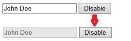

# [Kendo UI 开发教程(15): Kendo MVVM 数据绑定(四) Disabled/Enabled](http://www.imobilebbs.com/wordpress/archives/4645)

Disabled 和 Enabled 绑定可以根据 ViewModel 的某个属性值的 true,false 来设置 DOM 元素的 enabled 和 diabled 属性。 
Disabled/enabled 属性只适用于 input,select 和 textarea 元素，当这些输入元素 disabled 后，用户无法修改其值。

```

<div id="view">
<input type="text" data-bind="value: name, disabled: isNameDisabled" />
<button data-bind="click: disableInput">Disable</button>
</div>
<script>
    var viewModel = kendo.observable({
        isNameDisabled: false,
        name: "John Doe",
        disableInput: function () {
            this.set("isNameDisabled", true);
        }
    });

    kendo.bind($("#view"), viewModel);
</script>

```



注： 对于一些非 boolean 值如：0,null, undefined 会被看作 false ,其它值均当成 true .

Tags: [JavaScript](http://www.imobilebbs.com/wordpress/archives/tag/javascript), [Kendo UI](http://www.imobilebbs.com/wordpress/archives/tag/kendo-ui)
