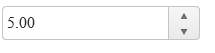
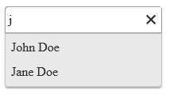

# [Kendo UI 開發教程(3): 初始化 Data 屬性](http://www.imobilebbs.com/wordpress/archives/4588)


前面在介紹準備 Kendo UI 開發環境時我們使用 jQuery 的方法將一個  HTML 元素轉換成一個 Kendo UI 控制項： $(“#datepicker”).kendoDatePicker();
除了使用 jQuery 插件的方法來初始化方法外，每個 Kendo 控制項還可以通過 data 屬性來初始化，此時你需要設置 data 的 role 屬性，然後調用 kendo.init 方法。
使用初始化 Data 屬性的方法在頁面上包含有大量 Kendo UI 控制項時非常便利。 首先， 組件的配置包含在目標元素中，第二無需首先查找每個元素然後調用 jQuery 方法，你只需調用一次 kendo.init()方法。
Kendo UI Mobile 應用通常使用 Data 屬性來初始化。

如下例使用 data 屬性來初始化一個 UI 組件

```

<div id="container">
    <input data-role="numerictextbox" />
</div>
<script>
kendo.init($("#container"));
</script>

```



其中方法 kendo.init($(“#container”)) 會查找所有包含有 data-role 屬性的元素，然後初始化這些 Kendo UI 組件。 每個 kendo UI 組件的 role 的值為該UI組件名稱的小寫名字，比如” autocomplete ”或” dropdownlist ”。

預設情況下，kendo.init 只會初始化 Kendo UI Web 組件和 Kendo UI DataViz 組件（按這個順序）。 而 Kendo UIMobile 應用 首先初始 化Kendo UI Mobile 組件，然後是 Kendo UI Web 組件，最後是 Kendo UI DataViz 組件。 這意味著 data-role=”listview ” 在 Mobile 應用中會預設初始化為 Kendo UI Mobile Listview。 然而可以通過指明組件全稱的方法在修改這個預設初始化順序。
比如：在 Mobile 應用中 指明使用 Kendo UI Web 的 listview

```

<div data-role="view">
    <!-- specify the Kendo UI Web ListView widget -->
    <div data-role="kendo.ui.ListView"></div>
</div>
<script>
var app = new kendo.mobile.Application();
</script>

```

# 配置 

每個組件可以通過 Data 屬性來進行配置，對於配置的屬性，只需在屬性名前加上 data-前綴就可以做為目標元素的屬性進行配置。比如 data-delay=”100″。 對於一些使用 Camel-cased 的屬性則是通過添加「-」 ，比如 AutoComplete 的 ignoreCase 的屬性可以通過 data-ignore-case 來設置。而對於一些已經是使用 data 前綴的屬性則無需再添加 data-前綴。比如 dataTextField 屬性可以通過 data-text-field 屬性來配置, dataSource 屬性可以通過 data-source 屬性來配置。對於一些複雜的配置可以通過 JavaScript 對象字面量來配置，比如：data-source=”{data: [{name: ‘John Doe’},{name: ‘Jane Doe’]}”.

如下例：

```

<div id="container">
	<input data-role="autocomplete"
		data-ignore-case="true"
		   data-text-field="name"
		data-source="{data: [{name: 'John Doe'},{name: 'Jane Doe'}]}"
		 />
</div>
<script>
	kendo.init($("#container"));

</script>

```



# 事件

你也可以通過 data 屬性添加對 Kendo UI 組件的事件處理，屬性的值被當成一個 JavaScript 函數，其作用域為全局。

如下例：

```

<div id="container">
    <input data-role="numerictextbox" data-change="numerictextbox_change" />
</div>
<script>
function numerictextbox_change(e) {
    // Handle the "change" event
}
kendo.init($("#container"));
</script>

```
事件處理函數也可以為一個成員函數，比如 foo.bar 可以看出為 foo 對象的 bar 方法。

例如：

```

<div id="container">
    <input data-role="numerictextbox" data-change="handler.numerictextbox_change" />
</div>
<script>
var handler = {
    numerictextbox_change: function (e) {
        // Handle the "change" event
    }
};
kendo.init($("#container"));
</script>

```

# 數據源

支持數據綁定的 UI 組件的數據源也可以通過 data-source 屬性來指定。 這個屬性可以 為一個 JavaScript 對象，一個數組或是一個全局變數。

例如：

使用 JavaScript 數組作為數據源。

```

<div id="container">
    <input data-role="autocomplete" data-source="{data:['One', 'Two']}" />
</div>
<script>
kendo.init($("#container"));
</script>

```

使用 JavaScript 數組作為數據源。


```

<div id="container">
    <input data-role="autocomplete" data-source="['One', 'Two']" />
</div>
<script>
kendo.init($("#container"));
</script>

```

使用一個可以全局訪問的變數作為數據源。

```

<div id="container">
    <input data-role="autocomplete" data-source="dataSource" />
</div>
<script>
var dataSource = new kendo.data.DataSource( {
    data: [ "One", "Two" ]
});
kendo.init($("#container"));
</script>

```

# 模板

模板也可以通過 Data 屬性來設置，屬性的值代表用來定義模板的 Script 元素的 Id。比如：

```

<div id="container">
    <input data-role="autocomplete"
           data-source="[{firstName:'John', lastName: 'Doe'}, {firstName:'Jane', lastName: 'Doe'}]"
           data-text-field="firstName"
           data-template="template" />
</div>
<script id="template" type="text/x-kendo-template">
    <span>#: firstName # #: lastName #</span>
</script>
<script>
kendo.init($("#container"));
</script>

```

Tags: [JavaScript](http://www.imobilebbs.com/wordpress/archives/tag/javascript)