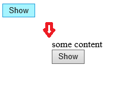

# [Kendo UI 开发教程(18): Kendo MVVM 数据绑定(七) Invisible/Visible](http://www.imobilebbs.com/wordpress/archives/4654)

Invisible/Visible 绑定可以根据 ViewModel 的某个属性来显示/隐藏 DOM 元素。
例如：

```

<div id="view">
    <div data-bind="invisible: isInvisible">some content
       
    </div>
     <button data-bind="click: show">Show</button>
</div>
<script>
    var viewModel = kendo.observable({
        isInvisible: true,
        show: function () {
            this.set("isInvisible", false);
        }
    });

    kendo.bind($("#view"), viewModel);
</script>

```



Tags: [JavaScript](http://www.imobilebbs.com/wordpress/archives/tag/javascript), [Kendo UI](http://www.imobilebbs.com/wordpress/archives/tag/kendo-ui)