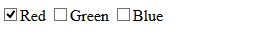
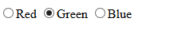

# [Kendo UI 开发教程(13): Kendo MVVM 数据绑定(二) Checked](http://www.imobilebbs.com/wordpress/archives/4637)

Checked 绑定用在 checkbox ()或 radio button ()上。
注意： checked 绑定只适用于支持 checked 的 DOM 元素，其它 DOM 元素的值可以使用 value 绑定。

多选钮(Checkedbox） checked 绑定
使用 Kendo checked 绑定到 checkbox 时，当 ViewModel 对应的值为 true, Checkbox 显示选中状态，而当用户点击 checkbox 选择状态时，对应的 ViewModel 的值也随之变化。

例如：

```

<input type="checkbox" data-bind="checked: isChecked" />
<script>
var viewModel = kendo.observable({
    isChecked: false
});

kendo.bind($("input"), viewModel);
</script>

```

本例，因为 viewModel 的 isChecked 初始值为 false,因此 Checkbox 显示未选状态，如果此时用户点击选择该选项，那么 viewModel 的 isChecked 的值为 true .

# 绑定一个数组到一组多选框

checked 绑定支持把 ViewModel 对象的一个数组属性绑定到一组多选框， 选择一组多选框的某个 Checkbox，它的值被添加到 ViewModel 的数组中，反之，该值从数组中移除。

```

<input type="checkbox" value="Red" data-bind="checked: colors" />Red
<input type="checkbox" value="Green" data-bind="checked: colors" />Green
<input type="checkbox" value="Blue" data-bind="checked: colors" />Blue
<script>
	var viewModel = kendo.observable({
		colors: ["Red"]
	});

	kendo.bind($("input"), viewModel);
</script>

```



在这个例子中，第一个 checkbox 显示选择状态，是因为它的 value  值 ”Red”  包含在 ViewModel 数组 colors 中， 如果此时选择 Green ，那么 colors 数组变为 Red 和 Green . 如果去除选择 Red ,则 Colors 数组只包含 Green .

单选钮(Radio Button） checked 绑定 
Kendo MVVM 只有在 ViewModel 的属性和对应的 radio button 的  value 值一致时才会显示该 Radio Button 为选中状态。

```

<input type="radio" value="Red" name="color" data-bind="checked: selectedColor" />Red
<input type="radio" value="Green" name="color" data-bind="checked: selectedColor" />Green
<input type="radio" value="Blue" name="color" data-bind="checked: selectedColor" />Blue
<script>
	var viewModel = kendo.observable({
		selectedColor: "Green"
	});

	kendo.bind($("input"), viewModel);
</script>

```



Tags: [JavaScript](http://www.imobilebbs.com/wordpress/archives/tag/javascript), [Kendo UI](http://www.imobilebbs.com/wordpress/archives/tag/kendo-ui)
