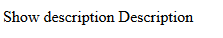

# [Kendo UI 开发教程(16): Kendo MVVM 数据绑定(五) Events](http://www.imobilebbs.com/wordpress/archives/4648)

本篇和 [Kendo UI 开发教程(14): Kendo MVVM 数据绑定(三) Click](http://www.imobilebbs.com/wordpress/archives/4641) 类似，为事件绑定的一般形式。
 Events 绑定支持将 ViewModel 的方法绑定到 DOM 元素的事件处理（如鼠标事件）。
例如：

```

<div id="view">
    <span data-bind="events: { mouseover: showDescription, mouseout: hideDescription }">Show description</span>
    <span data-bind="visible: isDescriptionShown, text: description"></span>
</div>
<script>
    var viewModel = kendo.observable({
        description: "Description",
        isDescriptionShown: false,
        showDescription: function (e) {
            // show the span by setting isDescriptionShown to true
            this.set("isDescriptionShown", true);
        },
        hideDescription: function (e) {
            // hide the span by setting isDescriptionShown to false
            this.set("isDescriptionShown", false);
        }
    });

    kendo.bind($("#view"), viewModel);
</script>

```



实际上，click 绑定是 events 绑定的一个特例，下面的两种实现是等效的：

```
<span data-bind="click: clickHandler"></span>

<span data-bind="events: { click: clickHandler }"></span>

```

注： Kendo MVVM 的 DOM 事件参数 e 封装在 jQuery 的 [Event](http://api.jquery.com/category/events/event-object/) 对象中。

# 中止事件向上传递

如果需要终止事件向上传递(event bubbling)，可以调用 stopPropagation 方法。

```

<span data-bind="click: click">Click</span>
<script>
var viewModel = kendo.observable({
    click: function(e) {
        e.stopPropagation();
    }
});

kendo.bind($("span"), viewModel);
</script>

```

# 停止事件缺省处理

如果要取消某些 DOM 元素单击后的缺省处理函数，比如转到其它页面或是提交表单，为了取消这些缺省实际处理，可以调用 preventDefault() 方法。例如：

```

<a href="http://example.com" data-bind="click: click">Click</span>
<script>
var viewModel = kendo.observable({
    click: function(e) {
        // stop the browser from navigating to http://example.com
        e.preventDefault();
    }
});

kendo.bind($("a"), viewModel);
</script>

```

Tags: [JavaScript](http://www.imobilebbs.com/wordpress/archives/tag/javascript), [Kendo UI](http://www.imobilebbs.com/wordpress/archives/tag/kendo-ui)

