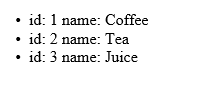

# [Kendo UI 开发教程(21): Kendo MVVM 数据绑定(十) Source](http://www.imobilebbs.com/wordpress/archives/4664)

Source 绑定可以把 ViewModel 的值和由 Kendo 模板定义的目标元素绑定，如果 ViewModel 的值发生变化，被绑定的目标元素也随之发生变化。
模板由属性 data-template 指定，它的值为某个 script 定义的模板的 id. 如果没有指明模板，则根据元素的标记使用缺省的模版。

# Source 绑定到数组
当 ViewModel 的值 为一数组时，那么通过 Source 绑定到模板时，会把数组中每个元素逐个应用到模板，最后的输出为应用这些模板的结果的综合。 添加删除数组中的内容，显示的内容也随之变化。

注：绑定到 ViewModel 数组时，Source 指明的为单个跟元素名称，例如：

```

<ul data-template="ul-template" data-bind="source: products">
</ul>
<script id="ul-template" type="text/x-kendo-template">
    <li>
        id: <span data-bind="text: id"></span>
        name: <span data-bind="text: name"></span>
    </li>
</script>
<script>
var viewModel = kendo.observable({
    products: [
        { id: 1, name: "Coffee" },
        { id: 2, name: "Tea" },
        { id: 3, name: "Juice" }
    ]
});

kendo.bind($("ul"), viewModel);
</script>

```

这个例子会输出三个 li 元素–每个对应到 products 数组中一个元素，下面为输出的 HTML 内容：

```

<ul>
    <li>
        id: <span>1</span>
        name: <span>Coffee</span>
    </li>
    <li>
        id: <span>2</span>
        name: <span>Tea</span>
    </li>
    <li>
        id: <span>3</span>
        name: <span>Juice</span>
    </li>
</ul>

```



如果 ViewModel 绑定的数组的内容为简单类型（如数字，字符串，日期），这时在模板中需要使用 ”this” 关键字来引用当前数组项：

```

<ul data-template="ul-template" data-bind="source: products">
</ul>
<script id="ul-template" type="text/x-kendo-template">
    <li data-bind="text: this"></li>
</script>
<script>
var viewModel = kendo.observable({
    products: [ "Coffee", "Tea", "Juice" ]
});

kendo.bind($("ul"), viewModel);
</script>

```

输出内容如下：

```

<ul>
    <li>Coffee</li>
    <li>Tea</li>
    <li>Juice</li>
</ul>

```

# Source绑定到非数组

source 绑定也支持绑定到非数组值，此时在模板中引用到 ViewModel 的某个属性，最终的结果为模板使用 ViewModel 后的结果。

```
<div data-template="div-template" data-bind="source: person">
    <script id="div-template" type="text/x-kendo-template">
    Name: <span data-bind="text: name"></span>
    </script>
</div>
<script>
var viewModel = kendo.observable({
    person: {
        name: "John Doe"
    }
});

kendo.bind($("div"), viewModel);
</script>

```

输出：

```

<div>
    Name: <span>John Doe</span>
</div>

```

你也可以直接绑定到 ViewModel 对象本身，此时可以使用把 source 的值设置为 “this” ，例如：

```
<div data-template="div-template" data-bind="source: this">
    <script id="div-template" type="text/x-kendo-template">
    Name: <span data-bind="text: name"></span>
    </script>
</div>
<script>
var viewModel = kendo.observable({
    name: "John Doe"
});

kendo.bind($("div"), viewModel);
</script>

```

结果如下：

```

<div>
Name: <span>John Doe</span>
</div>

```

# Source 绑定 Select 元素

当数组绑定到 select 元素时，就创建多个 option 元素。

```

<select data-bind="source: colors"></select>
<script>
var viewModel = kendo.observable({
    colors: [ "Red", "Green", "Blue" ]
});

kendo.bind($("select"), viewModel);
</script>

```

输出的 HTML 元素如下：

```
<select>
    <option>Red</option>
    <option>Green</option>
    <option>Blue</option>
</select>

```

select 元素也可以绑定到 JavaScript 对象数组（非简单类型），此时可以同时指定 data-text-field,data-value-field 用来指定 option 元素的 value 和 text 属性，例如：

```

<select data-text-field="name" data-value-field="id"
       data-bind="source: products"></select>
<script>
var viewModel = kendo.observable({
    products: [
        { id: 1, name: "Coffee" },
        { id: 2, name: "Tea" },
        { id: 3, name: "Juice" }
    ]
});

kendo.bind($("select"), viewModel);
</script>

```

输出如下:

```

<select>
    <option value="1">Coffee</option>
    <option value="2">Tea</option>
    <option value="3">Juice</option>
</select>

```

Tags: [JavaScript](http://www.imobilebbs.com/wordpress/archives/tag/javascript), [Kendo UI](http://www.imobilebbs.com/wordpress/archives/tag/kendo-ui)
