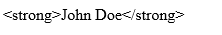

# [Kendo UI 开发教程(20): Kendo MVVM 数据绑定(九) Text](http://www.imobilebbs.com/wordpress/archives/4660)

Text 绑定可以使用 ViewModel 来设置 DOM 元素的文本属性，如果需要设置 input,textarea,或 select 的显示，需要使用 value 属性。

```

<span data-bind="text: name"></span>
<script>
var viewModel = kendo.observable({
    name: "John Doe"
});

kendo.bind($("span"), viewModel);
</script>

```

本例输出：

John Doe

如果 V iewModel 的值包含 html 标记，这些标记会直接显示出 html 标记，比如：

```
<span data-bind="text: name"></span>
<script>
var viewModel = kendo.observable({
    name: "<strong>John Doe</strong>"
});

kendo.bind($("span"), viewModel);
</script>

```




如果需要以粗体显示，则可以使用前面介绍的 [html](http://www.imobilebbs.com/wordpress/archives/4652) 绑定。

Tags: [JavaScript](http://www.imobilebbs.com/wordpress/archives/tag/javascript), [Kendo UI](http://www.imobilebbs.com/wordpress/archives/tag/kendo-ui)

