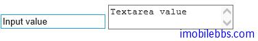
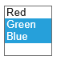

# [Kendo UI 开发教程(22): Kendo MVVM 数据绑定(十一) Value](http://www.imobilebbs.com/wordpress/archives/4671)

Value 绑定可以把 ViewModel 的某个属性绑定到 DOM 元素或某个 UI 组件的 Value 属性。当用户修改 DOM 元素或 UI 组件的值时，绑定的 ViewModel 的值也随之发生改名。同样，如果 ViewModel 的值发生变化，对应的 UI 也会发生变化。
注： Value 绑定只可以用在支持 Value 属性的 DOM 元素或 UI 组件。支持 Value 绑定的元素有 input,textarea 和 select, 支持value绑定的 UI 组件有 AutoComplete, DropDownlist, ComboBox, DatePicker, TimePicker,NumbericTextBox 和 Slider.
如果你需要设置 DOM 元素或 UI 组件的文本或是 HTML 内容，请使用 text 和 html 绑定。
对于Checkboxes () 或 radio button()请使用 checked 绑定。

# Input 和 textarea Value 绑定

```

<div id="view">
    <input data-bind="value: inputValue" />
    <textarea data-bind="value: textareaValue"></textarea>
</div>
<script>
var viewModel = kendo.observable({
    inputValue: "Input value",
    textareaValue: "Textarea value"
});

kendo.bind($("#view"), viewModel);
</script>

```

上面代码当调用 bind 方法后，input 元素显示 inputValue 的值，而 textarea 显示 textareaValue 的值。 如果用户修改 input 或 textarea 的值，对应的 inputValue 和 textareaValue 也随之变化。



缺省情况下，Value 绑定依赖于 DOM 的 change 事件，也就是当 DOM 元素失去焦点时触发该事件，UI 的变化实现对 ViewModel 的更新。然而可以通过修改 data-value-update 属性来使用不同的 DOM 事件，比如 keyup 或 keypress 事件（不可使用 keydown 事件，只是因为  keydown 事件 DOM 元素的 value 尚未发生变化）。

```

<div id="view">
    <input data-value-update="keyup" data-bind="value: inputValue" />
</div>
<script>
var viewModel = kendo.observable({
    inputValue: "Input value"
});

kendo.bind($("#view"), viewModel);
</script>

```

# Select 元素绑定 value

当 Select 元素使用了预定义的选项时，Kendo MVVM 将根据 ViewModel 的值把和 ViewModel 值相同的 option 选项设定为选中状态。

```
<select data-bind="value: selectedColor">
    <option value="red">Red</option>
    <option value="green">Green</option>
    <option value="blue">Blue</option>
</select>
<script>
var viewModel = kendo.observable({
    selectedColor: "green"
});

kendo.bind($("select"), viewModel);
</script>

```

在本例中，第二个选项（Green)被选中，这是因为它的 value 和 selectedColor 相同。 UI修改选项也会更新 selectedColor 的值。 如果 option 元素没有定义 value，那么使用 option 的 text 属性。

如果 select 支持多项选择，此时对应的 ViewModel 的属性也应该为一个数组。例如：

```

<select data-bind="value: selectedColors" multiple="multiple">
    <option>Red</option>
    <option>Green</option>
    <option>Blue</option>
</select>
<script>
var viewModel = kendo.observable({
    selectedColors: ["Blue","Green"]
});

kendo.bind($("select"), viewModel);
</script>

```



Tags: [JavaScript](http://www.imobilebbs.com/wordpress/archives/tag/javascript), [Kendo UI](http://www.imobilebbs.com/wordpress/archives/tag/kendo-ui)

