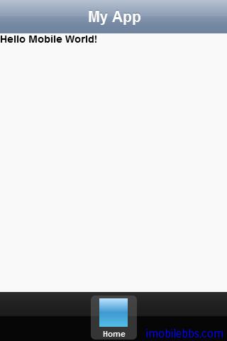

# [Kendo UI 开发教程(27): 移动应用开发简介](http://www.imobilebbs.com/wordpress/archives/4693)

Kendo UI 支持开发 Web 应用，前面介绍的 SPA，也支持开发移动应用，至于使用 HTML5 + JavaScript + CSS 开发移动是不是一个好的选择不在本文的讨论之中。Kendo UI Mobile 提供了一种快速开发跨手机平台的方法（ Kendo UI 可以使得这种 Web 应用在界面上看起来和本地应用非常类似）。如果你的移动应用需要数据的支持，了解一些 [JSON](http://en.wikipedia.org/wiki/JSON) 方面计的知识也是必须的。
借助于 PhoneGap 等工具可以 HTML5 打包成移动平台的本地应用，并支持使用 JavaScript 访问一些平台相关的功能，如 GPS，Camera 等功能，有兴趣的可以参考相关文档。

下面三点为构成 Kendo 移动应用的几个组成部分：

1. [Application](http://demos.kendoui.com/mobile/application/index.html): Kendo 移动应用的主应用类，用来管理应用部分部分之间切换，应用页面历史，加载 View 以及其它一些重要的移动应用相关的任务。
2. [Layout](http://demos.kendoui.com/mobile/layout/index.html): 定义移动应用 UI 的布局，类似于 Web 应用的 MasterPage，主要可以用来定义不同 View 之间一些公用的部分，比如菜单。
3. [Views](http://demos.kendoui.com/mobile/view/index.html): 移动应用的每个页面，每个应用包含一个或多个页面。

Layouts 和 View 使用 HTML 来定义，而 Application 为 JavaScript。 下面的步骤给出了编写 Kendo UI 移动应用的基本步骤。

# 第一步：　创建 HTML 页面

Kendo　UI 移动应用可以使用简单的 HTML 页面来创建，这里我们创建一个简单的 index.html 如下：

```

<!DOCTYPE html>
<html>
<head>
    <title>My App</title>
    <!--TODO: Add CSS links-->
</head>
<body>

    <!--TODO: Add JavaScript referneces-->
</body>
</html>

```

# 第二步：添加 Kendo UI Mobile 的引用

添加 Kendu UI Mobile CSS 和 Javascript 的引用。 

```

<!DOCTYPE html>
<html>
<head>
    <title>My App</title>

    <link href="css/kendo.mobile.all.min.css" rel="stylesheet" />
</head>
<body>

    <script src="js/jquery.min.js"></script>
    <script src="js/kendo.all.min.js"></script>
</body>
</html>

```

# 第三步：定义应用布局文件

Layout 为应用 UI 的模板，应用所有的 View 的内容都使用模板来显示，一个 Layout 可以包含任意的内容，通常它包含有标题头和任务栏。比如下面的 Layout:

```

<!DOCTYPE html>
<html>
<head>
    <title>My App</title>

    <link href="css/kendo.mobile.all.min.css" rel="stylesheet" />
</head>
<body>
    <section data-role="layout" data-id="default">
        <header data-role="header">
            <div data-role="navbar">My App</div>
        </header>
        <!--View content will render here-->
        <footer data-role="footer">
            <div data-role="tabstrip">
                <a href="#home">Home</a>        
            </div> 
        </footer>
    </section>

    <script src="js/jquery.min.js"></script>
    <script src="js/kendo.all.min.js"></script>
</body>
</html>

```

代码中使用 data-role 属性，这个属性用来建立 HTML 和 Kendo UImobile 库之间的联系。因此

```

<section data-role="layout" data-id="default">

```

在应用初始化时，这部分定义将转换为 Layout 定义。 data-id 为该 Layout 的 id，后面定义的 view 可以通过这个 id 来引用某个 layout.
最后，为完整起见，这段代码还使用了 NavBar 和 TabStrip 两个用在移动应用中的 UI 组件。

#  第四步：构造 View

创建好 Layout 之后，应用至少要创建一个 View 用来显示，大部分应用包含有多个 View，这里我们创建一个简单的 View 如下：

```

<!DOCTYPE html>
<html>
<head>
    <title>My App</title>

    <link href="css/kendo.mobile.all.min.css" rel="stylesheet" />
</head>
<body>
    <div id="home" data-role="view" data-layout="default">
        Hello Mobile World!
    </div>

    <section data-role="layout" data-id="default">
        <header data-role="header">
            <div data-role="navbar">My App</div>
        </header>
        <!--View content will render here-->
        <footer data-role="footer">
            <div data-role="tabstrip">
                <a href="#home">Home</a>        
            </div> 
        </footer>
    </section>

    <script src="js/jquery.min.js"></script>
    <script src="js/kendo.all.min.js"></script>
</body>
</html>

```

View 定义使用 data-role 属性“view”, data-layout 定义使用那个 layout.

# 第五步：初始化移动应用

前面定义了一些 HTML 元素，还没有使用任何 JavaScript，使用下面一行代码，可以使得前面定义的 HTML 变得和本地应用类似：

```

<script>
    var app = new kendo.mobile.Application();
</script>

```


 
样一个简单的移动应用就出现了，Kendo UI 缺省情况下使用 iOS 界面（如上图），在手机上运行会根据手机平台的不同选择合适的界面风格，你也可以通过指定平台类型，比如：

```

<script>
    var app = new kendo.mobile.Application(document.body, 
    {
        platform:'android'
    });
</script>

```

来测试你的应用在不同平台上显示，也可以根据平台的不同，对应用做些调整，比如：

```

<div data-role="layout" data-id="foo" data-platform="ios">
    <div data-role="header">iOS App</div>
</div>

<div data-role="layout" data-id="foo" data-platform="android">
    <div data-role="header">Android App</div>
</div>

```

注意的是 data-platform 属性目前只支持在 layout 中使用。

 
Tags: [JavaScript](http://www.imobilebbs.com/wordpress/archives/tag/javascript), [Kendo UI](http://www.imobilebbs.com/wordpress/archives/tag/kendo-ui)