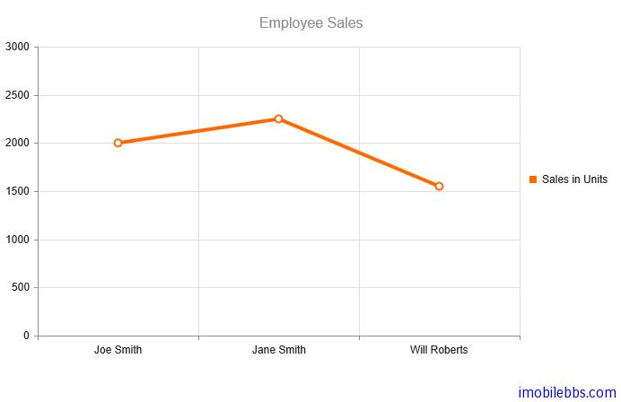

# [Kendo UI 开发教程(6): Kendo DataSource 概述](http://www.imobilebbs.com/wordpress/archives/4605)

Kendo 的数据源支持本地数据源（ JavaScript 对象数组），或者远程数据源（XML, JSON, JSONP)，支持 CRUD 操作（创建，读取，更新和删除操作），并支持排序，分页，过滤，分组和集合等。

# 准备开始

下面创建一个本地数据源。

```

var movies = [ {
      title: "Star Wars: A New Hope",
      year: 1977
   }, {
     title: "Star Wars: The Empire Strikes Back",
     year: 1980
   }, {
     title: "Star Wars: Return of the Jedi",
     year: 1983
   }
];
var localDataSource = new kendo.data.DataSource({data: movies});

```
创建一个远程数据源 （Twitter）

```

var dataSource = new kendo.data.DataSource({
    transport: {
        read: {
            // the remote service url
            url: "http://search.twitter.com/search.json",

            // JSONP is required for cross-domain AJAX
            dataType: "jsonp",

            // additional parameters sent to the remote service
            data: {
                q: "html5"
            }
        }
    },
    // describe the result format
    schema: {
        // the data which the data source will be bound to is in the "results" field
        data: "results"
    }
});

```
# 绑定数据源到 UI 组件

Kendo UI 组件很多都支持数据绑定 ，UI 组件绑定的数据源可以在配置 UI 组件时设置，或是多个 UI 组件共享同一个数据源。

创建UI组件时设置 DataSource 属性

```

$("#chart").kendoChart({
    title: {
        text: "Employee Sales"
    },
    dataSource: new kendo.data.DataSource({
        data: [
        {
            employee: "Joe Smith",
            sales: 2000
        },
        {
            employee: "Jane Smith",
            sales: 2250
        },
        {
            employee: "Will Roberts",
            sales: 1550
        }]
    }),
    series: [{
        type: "line",
        field: "sales",
        name: "Sales in Units"
    }],
    categoryAxis: {
        field: "employee"
    }
});

```



使用共享的远程数据源

```

var sharableDataSource = new kendo.data.DataSource({
    transport: {
        read: {
            url: "data-service.json",
            dataType: "json"
        }
    }
});

// Bind two UI widgets to same DataSource
$("#chart").kendoChart({
    title: {
        text: "Employee Sales"
    },
    dataSource: sharableDataSource,
    series: [{
        field: "sales",
        name: "Sales in Units"
    }],
    categoryAxis: {
        field: "employee"
    }
});

$("#grid").kendoGrid({
    dataSource: sharableDataSource,
        columns: [
        {
            field: "employee",
            title: "Employee"
        },
        {
            field: "sales",
            title: "Sales",
            template: '#= kendo.toString(sales, "N0") #'
    }]
});

```

这个例子使用了模板 template ,模板的用法参见后面的文章。

Tags: [JavaScript, Kendo UI](http://www.imobilebbs.com/wordpress/archives/tag/kendo-ui)