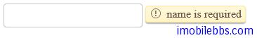

# [Kendo UI 開發教程(9): Kendo UI Validator 概述](http://www.imobilebbs.com/wordpress/archives/4615)

Kendo UI Validator 支持了客戶端校驗的便捷方法，它基於 HTML 5 的表單校驗功能，支持很多內置的校驗規則，同時也提供了自定義規則的便捷方法。

完整的 Kendo UI 的 Validator 可以參見 [API ](http://docs.kendoui.com/api/framework/validator)文檔。

# HTML 5 表單校驗
HTML5 的一項重要功能是[HTML 5 表單校驗屬性](https://developer.mozilla.org/en/HTML/Forms_in_HTML#Constraint_Validation)， 通過設置限制屬性為 HTML 輸入設置輸入類型，值域等，然後由瀏覽器來檢查輸入是否合法。 支持的幾種規則有：

- 必填域
- 正規表達式規則
- 最大，最小值域
- HTML 5 數據類型（ 如 EMail， URL，數值等）
- 
為了使用這些規則，可以通過為HTML輸入添加對應的屬性的方法來設置。比如：

```

<input type="email" required>

```

如果瀏覽器支持 HTML5，則它會自動根據這些規則來檢查輸入的值是否符合規則，如果輸入數據無效，瀏覽器會顯示錯誤信息給用戶，也不會提交表單。HTML5 也支持了一些新添的 JavaScript 方法來實現手工校驗，比如 checkValidity()方法。

HTML 5 表單校驗存在的問題
HTML 5 表單校驗非常有用，但它也存在一些問題，比如：

一些舊版本瀏覽器不支持 HTML5.
某些支持 HTML5 的瀏覽器對 HTML 5 表單支持不完整。
由瀏覽器生成的錯誤信息很難為它們重新定義顯示風格。
Kendo UI Validator 就是為了解決上面的這些問題而實現的。

# Kendo UI Validator 的基本配置

Kendo UI Validator 支持標準的 HTML5 表單校驗屬性，從而允許你正常使用 HTML 5 表單校驗屬性，從而可以在所有瀏覽器（IE7+）上使用這些屬性，比如：

```

<div id="myform">
    <input type="text" name="firstName" required />
    <input type="text" name="lastName" required />
    <button id="save" type="button">Save</button>
</div>

```

然後，在頁面上添加 Kendo UI Validator，添加在 Script 部分，比如：

```

// Initialize the Kendo UI Validator on your "form" container
// (NOTE: Does NOT have to be a HTML form tag)
var validator = $("#myform").kendoValidator().data("kendoValidator");

// Validate the input when the Save button is clicked
$("#save").on("click", function() {
    if (validator.validate()) {
        // If the form is valid, the Validator will return true
        save();
    }
});

```

使用這樣的簡單配置，這些 HTML5 表單校驗在舊版本瀏覽器中也可以工作，並且 Web 應用可以完全控制錯誤信息的顯示和其顯示風格，當點擊「Save” 按鈕後，如果輸入不滿足輸入規則，Kendo UI Validator 顯示合適的錯誤信息， 每個 HTML 元素也可以通過 validatorMessage 定義一個自定義的錯誤信息，比如：

```

<input type="tel" pattern="\d{10}" validationMessage="Plase enter a ten digit phone number" />

```

# 預設支持的校驗規則

輸入項必填規則

```

<input type="text" name="firstName" required />

```

輸入必須符合指定的正規表達式

```

<input type="text" name="twitter" pattern="https?://(?:www\.)?twitter\.com/.+i" />

```

最大，最小值限制

```

<input type="number" name="age" min="1" max="42" />

```

輸入步驟和最大，最小值限制一同使用

```

<input type="number" name="age" min="1" max="100" step="2" />

```

輸入為有效的 URL

```

<input type="url" name="url" />

```

輸入為有效的 EMail

```

<input type="email" name="email" />

```

除此之外，Kendo UI Validator 也支持自定義的規則。

# 自定義規則

使用自定義規則時的注意事項：

- 表單的每個元素都會執行自定義規則，因此如果表單中有多個輸入項，注意檢查輸入項的類型，然後再執行合適的校驗規則，比如：

```

custom: function (input) {
    if (input.is("[name=firstName]")) {
        return input.val() === "Test"
    } else {
        return true;
    }
}

```

- 如果自定義規則返回 true,那麼表示校驗成功。
- 如果有多個自定義規則，那麼會按屬性執行這些自定義規則，在發生錯誤時停止後續校驗規則的執行，而是顯示錯誤信息。只有所有規則都通過才表示表單校驗成功。
- 自定義錯誤信息必須和自定義規則匹配，如果沒有定義自定義錯誤信息，則顯示一個簡單的出錯圖標。

# 自定義輸入提示的位置

預設情況下 Kendo UI 將輸入提示顯示在輸入框附近，然而，如果輸入通過Kendo UI插件轉換為 ComboBox ，AutoComplete 或其它 Kendo UI 組件後，預設的輸入提示可能會影響到某些重要信息的顯示，這時，你可以指定在什麼地方顯示輸入提示，這時，可以通過添加一個 span 元素，定義  data-for 屬性到需要校驗的輸入框的 name, 並添加 .k-invalid-msg  類。

比如：

```

custom: function (input) {
    if (input.is("[name=firstName]")) {
        return input.val() === "Test"  
    } else {
        return true;
    }
}

```



Tags: [JavaScript](http://www.imobilebbs.com/wordpress/archives/tag/javascript), [Kendo UI](http://www.imobilebbs.com/wordpress/archives/tag/kendo-ui)
