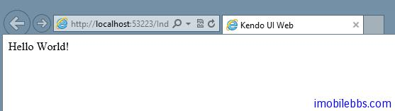

# [Kendo UI 开发教程(23): 单页面应用(一)概述](http://www.imobilebbs.com/wordpress/archives/4676)

Kendo 单页面应用(Single-Page Application,缩写为 SPA）定义了一组类用于简化 Web 应用（Rich Client）开发，最常见的单页面应用为  Gmail 应用，使用单页面可以给用户有使用桌面应用的用户体验。
 Kendo 的 Route 类负责跟踪应用的当前状态和支持在应用的不同状态之间切换。 Route 通过 Url 的片段功能（#url)和流量器的浏览历史功能融合在一起。从而可以支持把应用的某个状态作为书签添加到浏览器中。Route 也支持通过代码在应用的不同状态之间切换。
 View 和 Layout 类用于 UI 的显示。 UI 事件和数据绑定可以通过 MVVM 或 data 初始化属性来完成。
下面为一个最简单的 SPA 应用框架。

```

<div id="app"></div>

<script id="index" type="text/x-kendo-template">
    Hello <span data-bind="text: foo"></span>
</script>

<script>
    var index = new kendo.View(
        "index", // the id of the script element that contains the view markup
        { model: kendo.observable({ foo: "World!" }) }
    );

    var router = new kendo.Router();

    router.route("/", function() {
        index.render("#app");
    });

    $(function() {
        router.start();
    });
</script>

```

运行这个应用，显示“Hello，World”。



Tags: [JavaScript](http://www.imobilebbs.com/wordpress/archives/tag/javascript), [Kendo UI](http://www.imobilebbs.com/wordpress/archives/tag/kendo-ui)

