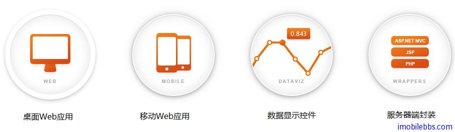

# [Kendo UI 開發教程(1): 概述](http://www.imobilebbs.com/wordpress/archives/4576)

JavaScript 在開發 Web 應用的作用越來越大 JQuery 簡化了 [HTML](http://zh.wikipedia.org/wiki/HTML) 和 JavaScript 之間的操作，jQuery 的教程可以參見本博客 [jQuery 和 jQuery UI 入門教程](http://www.imobilebbs.com/wordpress/archives/4312)，jQuery UI 是一套 JavaScript 函式庫，提供抽象化、可自訂主題的 GUI 控制項與動畫效果。基於 jQuery JavaScript 函式庫，可用來建構互動式的 Web 應用。

在開發 Web 應用時，可以直接使用 jQueryUI ，也可以使用其它一些基於 jQuery 的其它 UI 框架，其中 Kendo (日文劍道） UI 就是其中的佼佼者。兩種框架各有所長，下表列出兩種 UI 框架的簡單比較：

| 分類           | jQuery UI          | Kendo UI  |  
|:----------------- |:--------------- |:---------- |  
| Widgets (Total)  | Yes (8) | Yes (18 Web; 8 Mobile) |  
| Themes (Total)      | Yes (25)     |   Yes (5) |  
| Interactions (Total) | Yes (5)   |    Yes (6) |  
| Templates            | No (see [Template](http://wiki.jqueryui.com/w/page/37898666/Template))| Yes |  
| DataSource           | No (see [Dataview](http://wiki.jqueryui.com/w/page/47179141/Dataview))| Yes |     
|[Model-View-ViewModel](http://en.wikipedia.org/wiki/Model_View_ViewModel) (MVVM)| No |  Yes|  
| Data Visualization  | No | Yes |
| Globalization    |  No (see [Globalize](http://wiki.jqueryui.com/w/page/39118647/Globalize))| Yes |     
| Validation    | No (see [jQuery Validation Plugin](http://docs.jquery.com/Plugins/Validation)) | Yes |  
| Browser Support | IE 6+, Firefox 3+, Safari 3.1+, Opera 9.6+, Chrome | IE 7+, Firefox 3+, Safari 4+, Opera 10+, Chrome|  
| Mobile Device Compatibility | No (see [jQuery Mobile](http://jquerymobile.com/))| Yes |

可以看到 Kendo UI 和 jQuery UI 相比添加了模板（Template），數據源綁定（DataSource)，MVVM 和移動設備的支持，功能上相對要強大很多，但 Kendo UI 本身不是免費，它是由 [Telerik](http://www.telerik.com/) 公司開發並支持的.

Kendo UI 是一個基於 HTML5 和 jQuery 的 UI 框架用來開發時尚Web應用。這個UI框架包括的很多 UI 控制項，數據顯示組件，和自適應的手機框架，並支持數據綁定，使用模板，拖放功能。

Kendo UI 包含下面下面幾個開發包：

Kendo UI Web – 用於桌面瀏覽器的 HTML5UI 組件.
Kendo UI DataViz – 用於顯示數據的 HTML5UI 組件.
Kendo UI Mobile – 用於開發基於移動設備的 HTML5 UI 框架.
Kendo UI Complete -包含了上面三個開發包.
Kendo UI Complete for ASP.NET MVC -包括了 Web，DataViz 和 Mobile 並提供這些 UI 組件的 ASP.NETMVC 伺服器端封裝.
Kendo UI Complete for JSP – 包括了 Web，DataViz 和 Mobile 並提供這些 UI 組件的 JSP 伺服器端封裝.
Kendo UI Complete for PHP – 包括了 Web，DataViz 和 Mobile 並提供這些 UI 組件的 PHP 伺服器端封裝
 

將在後面的文章逐步介紹 Kendo UI 的使用。

Tags: [Kendo UI](http://www.imobilebbs.com/wordpress/archives/tag/kendo-ui)

