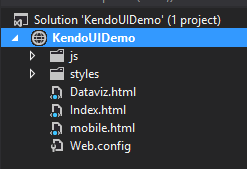
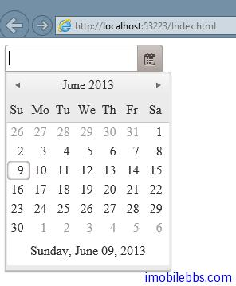
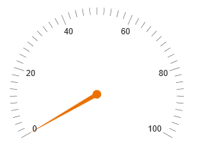
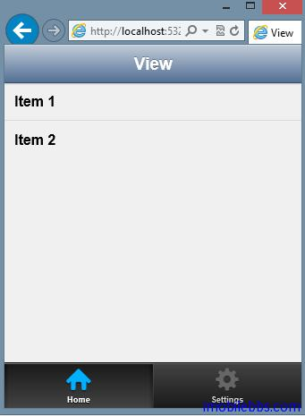

# [Kendo UI 開發教程(2):準備 Kendo UI 開發環境](http://www.imobilebbs.com/wordpress/archives/4580)

首先你需要從 Telerik 網站[下載試用版開發包](http://www.telerik.com/kendo-ui)，注意需要註冊後才能下載，或者從本站[下載](http://www.imobilebbs.com/wordpress/archives/www.imobilebbs.com/download/telerik/kendo/kendoui.complete.2013.1.514.trial.zip) （18M）

下載後直接解壓後包含下面幾個文件和目錄：

- ./examples – 示例.
- /js – minified 化後的 JavaScript 庫.
- /vsdoc JavaScript Intellisense 支持文件
- /styles – minified 後的 CSS 及主題資源.
- changelog.html – Kendo UI 發布文件.

如果你下載伺服器端支持（比如 ASP.NET，PHP 等）還可能包含
- .wrappers 目錄，支持伺服器端 UI 組件的封裝。

本教程側重於直接使用 JavaScript ，伺服器端支持只是使用 PHP,Net 等伺服器端 API 生產這些客戶端代碼（主要是 UI 組件的配置），Kendo UI 應用不需要這些伺服器端封裝就可以運行。

這裡我們使用 Visual Studio 2012 IDE 作為開發環境，你可以使用你自己熟悉的開發工具，或者直接使用 NotePad 都可以開發基於 Kendo UI 的 Web 應用。

下面就可以使用 Keudo UI 來開發 Web 應用了。首先使用 Visual Studio 創建一個空的 Web Site ，然後及 Kendo UI 的 js 和 styles 目錄拷貝到這個新創建的 Website 應用中。你如果直接使用 Notepad 作為開發工具，可以創建一個開發目錄，然後把 js,和 Styles 目錄拷貝過來也是一樣的。使用 Visual Studio 的一個好處是支持 Intelisense ，幫助編寫 JavaScript 代碼，這是就需要把 vsdoc 的內容拷貝到 js 目錄下。

然後添加三個 HTML 文檔用來測試。

- index.html     Web 應用測試頁
- dataviz.html  數據顯示測試頁
- mobile.html  移動應用測試頁



# Kendo UI Web 

編寫基於桌面系統的 Web 應用，使用 KendoUI WEB Javascript 庫，在 Html 的 Head 部分添加對應的 CSS 和 JavaScrpt，這裡我們使用一個 DataPicker 控制項做為示例，完整代碼如下：

```

<!doctype html>
<html>
    <head>
        <title>Kendo UI Web</title>
        <link href="styles/kendo.common.min.css" rel="stylesheet" />
        <link href="styles/kendo.default.min.css" rel="stylesheet" />
        <script src="js/jquery.min.js"></script>
        <script src="js/kendo.web.min.js"></script>
    </head>
    <body>
        <input id="datepicker" />
        <script>
            $(function () {
                $("#datepicker").kendoDatePicker();
            });
        </script>
    </body>
</html>

```



如果能夠正確顯示 dataPicker 控制項，就表示 Kendo UI Web 開發環境已經正確設置好了。

# Kendo UI DataViz

如果需要開發數據顯示控制項的 Web 頁面（比如 DataGrid，表格等），在頁面添加 DataViz 庫和 CSS 的應用，如下例顯示一個儀錶盤：

```

<!doctype html>
<html>
    <head>
        <title>Kendo UI DataViz</title>
        <link href="styles/kendo.dataviz.min.css" rel="stylesheet" />
        <script src="js/jquery.min.js"></script>
        <script src="js/kendo.dataviz.min.js"></script>
    </head>
    <body>
        <div id="gauge"></div>
        <script>
            $(function () {
                $("#gauge").kendoRadialGauge();
            });
        </script>
    </body>
</html>

```



# Kendo UI Mobile

最後，修改 mobile.html　測試一下移動 Web 應用

```

<!doctype html>
<html>
    <head>
        <title>Kendo UI Mobile</title>
        <link href="styles/kendo.mobile.all.min.css" rel="stylesheet" />
        <script src="js/jquery.min.js"></script>
        <script src="js/kendo.mobile.min.js"></script>
    </head>
    <body>
        <div data-role="view" data-title="View" id="index">
            <header data-role="header">
                <div data-role="navbar">
                    <span data-role="view-title"></span>
                </div>
            </header>
            <ul data-role="listview">
              <li>Item 1</li>
              <li>Item 2</li>
            </ul>
            <footer data-role="footer">
                <div data-role="tabstrip">
                    <a data-icon="home" href="#index">Home</a>
                    <a data-icon="settings" href="#settings">Settings</a>
                </div>
            </footer>
        </div>
        <script>
            var app = new kendo.mobile.Application();
        </script>
    </body>
</html>

```



這樣就設置好了 Kendo UI 的開發環境。

Tags: [Kendo UI](http://www.imobilebbs.com/wordpress/archives/tag/kendo-ui)