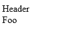
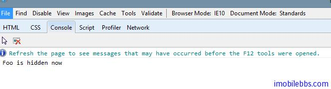

# [Kendo UI 开发教程(26): 单页面应用(四) Layout](http://www.imobilebbs.com/wordpress/archives/4689)

ayout 继承自 View，可以用来包含其它的 View 或是 Layout。
下面例子使用 Layout 来显示一个 View

```

<div id="app"></div>

<script>
    var view = new kendo.View("<span>Foo</span>");

    var layout = new kendo.Layout("<header>Header</header><section id='content'></section><footer></footer>");

    layout.render($("#app"));

    layout.showIn("#content", view);
</script>

```

这个例子创建一个 Layout 对象，这个 Layout 含有一个 Header，一个 Content 和一个 footer ,其中 Content以setion 元素定义，作为一个 PlaceHolder， 实际应用时可以使用某个 View 来替换。



Layout 本身也是一个 View，因此在 showIn 方法中也可以传入一个 Layout 对象，从而实现 Layout 的嵌套支持。

Layout 定义多个 View 统一的布局，定义了 View 的 Placeholder，因此在应用中可以实现 View 的切换。例如：

```

<div id="app"></div>

<script>
    var foo = new kendo.View("<span>Foo</span>", { hide: function() { console.log("Foo is hidden now"); }});
    var bar = new kendo.View("<span>Bar</span>");

    var layout = new kendo.Layout("<header>Header</header><section id='content'></section><footer></footer>");

    layout.render($("#app"));

    layout.showIn("#content", foo);
    layout.showIn("#content", bar);
</script>

```

这段代码首先显示”foo” ，然后很快切换到显示 “bar”。 这可以通过检查 log 来确认：



Tags: [JavaScript](http://www.imobilebbs.com/wordpress/archives/tag/javascript), [Kendo UI](http://www.imobilebbs.com/wordpress/archives/tag/kendo-ui)