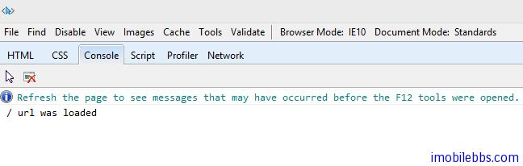
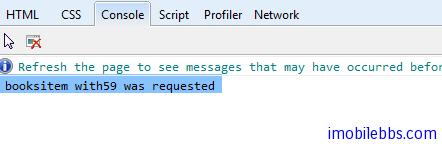
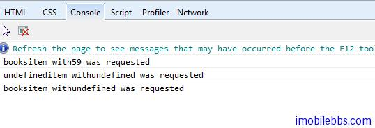
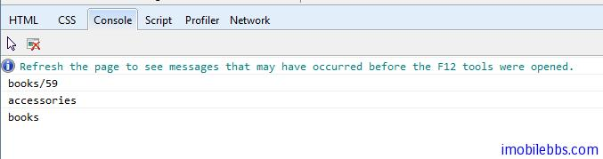

# [Kendo UI 开发教程(24): 单页面应用(二) Router 类](http://www.imobilebbs.com/wordpress/archives/4680)

Route 类负责跟踪应用的当前状态和支持在应用的不同状态之间切换。Route 通过 Url 的片段功能（#url)和流量器的浏览历史功能融合在一起。从而可以支持把应用的某个状态作为书签添加到浏览器中。Route 也支持通过代码在应用的不同状态之间切换。

# Router 根路径回调函数

```

<script>
    var router = new kendo.Router();

    router.route("/", function() {
        console.log("/ url was loaded");
    });

    $(function() {
        router.start();
    });
</script>


```

缺省情况下，如果 URL fragment 为空，将使用缺省的“/”的根路径，此时对于的回调函数被调用，不管初始 URL 是什么，这个初始化的回调函数总会调用。
如果使用 IE，按 F12 可以打开 Developer Window，选择 Console 可以看到 console.log 的打印信息。



# 参数

Router 支持 bound parameters, optional segments, 和 route globbing，类似于绑定参数，可选参数，匹配符匹配参数等。
例如：**绑定参数**

```

<script>
    var router = new kendo.Router();

    router.route("/items/:category/:id", function(category, id) {
        console.log(category, "item with", id, " was requested");
    });

    $(function() {
        router.start();

        // ...

        router.navigate("/items/books/59");
    });
</script>

```

当运行这个页面时，注意地址栏中的地址为：

<http://localhost:53223/Index.html#/items/books/59 –> #/items/books/59>



**可选参数**

如果 URL 的部分参数为可选的，此时 Route 的规则为使用”()”,将可选参数放在括号内。

```

<script>
    var router = new kendo.Router();

    router.route("/items(/:category)(/:id)", function(category, id) {
        console.log(category, "item with", id, " was requested");
    });

    $(function() {
        router.start();

        // ...
        router.navigate("/items/books/59");

        // ...
        router.navigate("/items");

        // ...
        router.navigate("/items/books");
    });
</script>

```




**使用×通配符匹配参数**

```

<script>
    var router = new kendo.Router();

    router.route("/items/*suffix", function(suffix) {
        console.log(suffix);
    });

    $(function() {
        router.start();

        // ...
        router.navigate("/items/books/59");

        // ...
        router.navigate("/items/accessories");

        // ...
        router.navigate("/items/books");
    });
</script>


```



# 页面切换

navigation 方法可以用来切换应用，对应的路径的回调方法被调用, navigation 方法修改 URL 的 fragment 部分(#后面部分）。
比如：

```

<a href="#/foo">Foo</a>

<script>
    var router = new kendo.Router();

    router.route("/foo", function() {
        console.log("welcome to foo");
    });

    $(function() {
        router.start();
        router.navigate("/foo");
    });
</script>

```

这个例子，将在地址栏显示 http://xxx/index.html#/foo。
如果对应的路径不存在，Router 类触发 routeMissing 事件，并把 URL 作为参数传入。

```
<script>
var router = new kendo.Router({ routeMissing: function(e) { console.log(e.url) } });

$(function() {
    router.start();
    router.navigate("/foo");
});
</script>

```

你可以通过 change 事件来截获这种页面之间的切换，然后调用 preventDefault 阻止页面切换。

```

<script>
var router = new kendo.Router({
    change: function(e) {
        console.log(url);
        e.preventDefault();
    }
});

$(function() {
    router.start();
    router.navigate("/foo");
});
</script>

```

Tags: [JavaScript](http://www.imobilebbs.com/wordpress/archives/tag/javascript), [Kendo UI](http://www.imobilebbs.com/wordpress/archives/tag/kendo-ui)