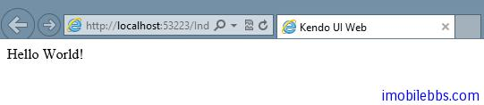

# [Kendo UI 开发教程(25): 单页面应用(三) View](http://www.imobilebbs.com/wordpress/archives/4686)

iew 为屏幕上某个可视部分，可以处理用户事件。 View 可以通过 HTML 创建或是通过 script 元素。缺省情况下 View 将其所包含的内容封装在一个 Div 元素中。
 Kendo 创建 View 有两种方式：

# 使用 HTML 字符串创建 View

```

<script>
    var index = new kendo.View('<span>Hello World!</span>');
</script>

```

或是使用

# 使用 Script 模板创建 View 

```

<script id="index" type="text/x-kendo-template">
    <span>Hello World!</span>
</script>

<script>
    var index = new kendo.View('index');
</script>

```

# 显示 View 内容

使用上述两种方法创建 View，可以使用 view 的 render 方法来显示, render 参数支持 jQuery 选择器，表示将 View 的内容显示到指定的DOM 元素中或添加到指定的 DOM 元素。
例如：显示 View

```

<div id="app"></div>

<script>
    var index = new kendo.View('<span>Hello World!</span>');

    index.render("#app");
</script>

```



本例将 View 的内容显示到 div 元素中，如果需要向某个 DOM 元素中添加 View 的内容，可以使用 append 方法。例如：

```

<div id="app"></div>

<script>
    var index = new kendo.View('<span>Hello World!</span>');

    $("#app").append(index.render());
</script>

```

# 集成 MVVM

在创建 View 时，可以传入一个 model 对象，此时 model 可以和创建的 view 绑定。例如：

```

<div id="app"></div>
<script id="index" type="text/x-kendo-template">
<div>Hello <span data-bind="text:foo"></span>!</div>
</script>

<script>
	var model = kendo.observable({ foo: "World" });
	var index = new kendo.View('index', { model: model });
	index.render("#app");
</script>

```

Tags: [JavaScript](http://www.imobilebbs.com/wordpress/archives/tag/javascript), [Kendo UI](http://www.imobilebbs.com/wordpress/archives/tag/kendo-ui)

