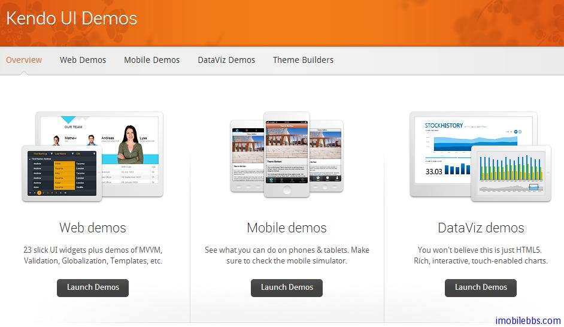

# [Kendo UI 开发教程(4): UI Widgets 概述](http://www.imobilebbs.com/wordpress/archives/4593)

Kendo UI 是基于 jQuery 库开发的，Kendo UI widgets 是以 jQuery 插件形式提供的。这些插件的名称基本上都是以 kendo 作为前缀。比如 Kendo 的 autocomplete UI  组件名称为 kendoAutoComplete ,Kendo UI 手机 UI 组件是以 “kendoMobile”为前缀。比如：”kendoMobileListView”.

# 使用 jQuery 初始化 Kendo UI 组件 

Kendo UI 组件使用页面上 HTML 元素来创建，使用 CSS 选择器 然后调用 jquery 插件（kendo UI 组件）将这些 HTML 元素转换为 Kendo UI 组件（基本方法和 jQuery UI 类似）。

例如：初始化一个自动提示输入框组件（autocomplete)

```

<input id="autocomplete" />
<script>
	$("#autocomplete").kendoAutoComplete(["Apples", "Oranges", "Grapes"]);
</script>

```

其中 $(“#autocomplete”).kendoAutoComplete([“Apples”, “Oranges”, “Grapes”]); 完成两项任务：

查找 Id 为 autocomplete 的 HTML 元素，#autocomplete 为 CSS 选择器
使用 kendoAutoComplete jQuery 插件初始化 Kendo UI 组件，并使用数组[“Apples”, “Oranges”, “Grapes”]作为配置参数传给 kendoAutoComplete 组件
注意：如果 jQuery 找不到由 css 选择器指定的 HTML 元素，Kendo UI 组件不会被创建，你可以使用任意合法的 CSS 选择器来初始化 Kendo UI 组件，对于每个符合选择器条件的HTML元素都会初始化一个 Kendo UI 组件。

# 配置 Kendo UI 组件

如前面例子，可以通过传递配置对象的方法来配置 Kendo UI 组件，配置对象为一组 Key/Value 对，这些 Key/Value 值用来配置 UI 组件。

如下例，配置一个 Grid 组件。

```

<div id="grid"></div>
<script>
$("#grid").kendoGrid({
  height: 200,
  columns:[
      {
          field: "FirstName",
          title: "First Name"
      },
      {
          field: "LastName",
          title: "Last Name"
      }
  ],
  dataSource: {
      data: [
          {
              FirstName: "John",
              LastName: "Doe"
          },
          {
              FirstName: "Jane",
              LastName: "Doe"
          }
      ]
  }
});
</script>

```



上面例子为 Grid 组件配置了 height, columns 和 dataSource. API 文档 包含了每个 Kendo UI 组件支持的配置项。

# 获取 Kendo UI 组件的引用对象

Kendo UI 通过 jQuery 插件的方式来初始化，但是调用这些方法时不会返回这些实例对象的引用，而是使用传统的 jQuery 方法来获取所创建的 Kendo UI 对象的引用，为了获得所创建的 Kendo UI 组件对象的引用，使用 jQuery data 方法，例如获取前面例子中创建  kendoAutoComplete 的对象，可以使用下面代码：

```

<input id="autocomplete" />
<script>
$("#autocomplete").kendoAutoComplete(["Apples", "Oranges", "Grapes"]);
var autocomplete = $("#autocomplete").data("kendoAutoComplete");
</script>

```
方法 $(“#autocomplete”).data(“kendoAutoComplete”) 返回所创建的 Kendo AutoComplete 对象。data 的参数为 Kendo UI 组件的名称，比如”kendoAutoComplete”, “kendoGrid ”等。

# 使用 Kendo UI 组件的方法

在获取 Kendo UI 组件对象的引用之后，就可以调用该 UI 组件的方法，例如：

```

<input id="autocomplete" />
<script>
$("#autocomplete").kendoAutoComplete(["Apples", "Oranges", "Grapes"]);
var autocomplete = $("#autocomplete").data("kendoAutoComplete");
autocomplete.value("Cherries");
var value = autocomplete.value();
alert(value); // Displays "Cherries"
</script>

```
上面的例子中获取 autocompete 对象之后，调用了它的 value()方法来写入和读取该输入框的内容。

# 监听 Kendo UI 事件

Kendo UI 组件支持多种事件，比如按键，鼠标，内容变化等事件，有两种方法可以为 Kendo Ui 组件定义事件处理方法：

```

<input id="autocomplete" />
<script>
function autocomplete_change() {
    // Handle the "change" event
}
$("#autocomplete").kendoAutoComplete({
    change: autocomplete_change
});
</script>

```

下面例子，使用 bind 方法。

```

<input id="autocomplete" />
<script>
function autocomplete_change() {
    // Handle the "change" event
}
$("#autocomplete").kendoAutoComplete();
var autocomplete = $("#autocomplete").data("kendoAutoComplete");
autocomplete.bind("change", autocomplete_change);
</script>

```

两种方法都把一个函数绑定到 a utocomplete 的” change ”事件。此时如果 autocomplete 内容发生变化，则触发 change 事件，相应的事件处理方法会被调用。

# 事件处理函数

事件处理函数在事件发生时被调用，该事件处理函数的传入参数包含了事件相关的 JavaScript 对象，你可以通过 sender 参数获得触发该事件的 UI 组件，比如：

```

<input id="autocomplete" />
<script>
function autocomplete_change(e) {
    var autocomplete = e.sender;
    var value = autocomplete.value();
    alert(value); // Displays the value of the AutoComplete widget
}
$("#autocomplete").kendoAutoComplete({
    change: autocomplete_change
});
</script>

```
此外，也可以使用 this 关键字来获取触发事件的 UI 对象引用，比如：

```

<input id="autocomplete" />
<script>
function autocomplete_change(e) {
    var autocomplete = this;
    var value = autocomplete.value();
    alert(value); // Displays the value of the AutoComplete widget
}
$("#autocomplete").kendoAutoComplete({
    change: autocomplete_change
});
</script>

```

Tags: [JavaScript, Kendo UI](http://www.imobilebbs.com/wordpress/archives/tag/kendo-ui)