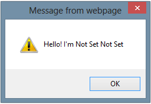
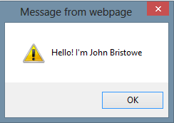
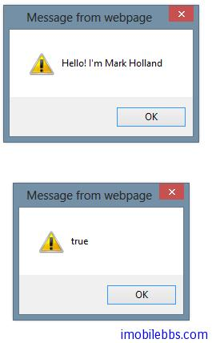
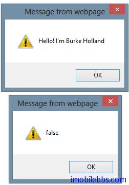

# [Kendo UI 开发教程(5): 使用 Kendo UI 库实现对象的继承](http://www.imobilebbs.com/wordpress/archives/4596)

avaScript 也是一种面向对象的开发语言，但和 C++，Java,C# 所不同的是，它的对象不是基于类（Class），而是基于对象原型（ProtoType)，因此对于来自 C++,Java 等背景的程序员，初次接触到 JavaScript 的面向对象的开发时，开始会有些不适应。而 JavaScript 语言本身也非常灵活，实现面向对象的方法也很多，不同的框架使用的方法也不同。

对于 JavaScript 的面向对象的方法和 C++，Java 面向对象的不同点，举个简单的类比，使用 C++,Java 来建房，是先有蓝图（Class），然后根据这个蓝图（Class）来建房（对象）。而 JavaScript 是直接建个房（Object），如果要将个新房，就参考这个建好的房作为原型（prototype)，然后复制一个对象。

Kendo UI 不仅仅提供了一些好看的UI组件，而且也提供一个 JavaScript 构建对象，实现继承的方法，其形式接近于 C++，Java 的类继承方法。

# 使用 kendo.Class.extend 创建对象

首先可以创建一个新对象（注意 JavaScript 中没有类的概念），可以通过kendo.Class.extend 来定义。

```

var person = kendo.Class.extend({});

```

上面代码创建一个 Person 对象，但没有定义 Person 对象任何属性和方法。下面可以为 Person 定义一些属性和方法（函数），可以通过对象字面量的方法来定义，Javascript 对象的属性或方法都是以 Key：value 的形式来定义。也使用 this 来引用对象的方法或属性。

```

var Person = kendo.Class.extend({
    firstName: 'Not Set',
    lastName: 'Not Set',
    isAPrettyCoolPerson: false,
    sayHello: function() {
        alert("Hello! I'm " + this.firstName + " " + this.lastName);
    }
});

var person = new Person();
person.sayHello();

```



# 创建构造函数

也可以为对象添加一个构造函数，Kendo UI 使用 init 来定义构造函数 ，这样在创建新对象时，可以通过构造函数来创建新的对象. 下面代码重新定义 Person 对象，并为其添加一个属性 isAPrettyCoolPerson ，

```

var Person = kendo.Class.extend({
    firstName: 'Not Set',
    lastName: 'Not Set',
    isAPrettyCoolPerson: false,
    init: function (firstName, lastName) {
        if (firstName) this.firstName = firstName;
        if (lastName) this.lastName = lastName;
    },

    sayHello: function () {
        alert("Hello! I'm " + this.firstName + " " + this.lastName);
    }

});

var person = new Person("John", "Bristowe");
person.isAPrettyCoolPerson = true;
person.sayHello();

```

我们使用这个对象，创建一个名为 John　，Bristowe　的Person,并把它的  isAPrettyCoolPerson 属性设为 True 。




# 创建一个派生对象

现在我们可以创建 Person 对象的一个派生对象 Parent，Parent 对象继承 Person 对象 ，然后我们创建一个 Dad 对象。

```

var person = new Person("John", "Bristowe");
person.isAPrettyCoolPerson = true;

var Parent = Person.extend({
    firstName: 'Mark',
    lastName: 'Holland'
});

var myDad = new Parent();
myDad.isAPrettyCoolPerson = true;

myDad.sayHello();
alert(myDad.isAPrettyCoolPerson);

```



我们再创建一个 Child 对象，继承自 Parent，要注意的是 isCoolPerson 属性。想想它的值是真还是假呢？

```

var Child = Parent.extend({});
  
var me = new Child();
me.firstName = "Burke";
me.sayHello();
alert(me.isAPrettyCoolPerson);

```



可以看到 me 的 isAPrettyCoolPerson 的值为 false, 没有因为 myDad 的  isAPrettyCoolPerson 为 True 而变为 true, 这些因为 Child 继承自 Parent ,Parent 缺省的 isAPrettyCoolPerson 为 false, myDad 修改的只是某个特定的实例的值，没有修改作为原型的对象（Parent）的属性。

 
Tags: [JavaScript, Kendo UI](http://www.imobilebbs.com/wordpress/archives/tag/kendo-ui) 
